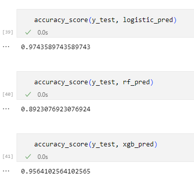

# 🚀 고객 분석 및 관리 시스템 (CRM-App)

## 📌 프로젝트 개요
이 프로젝트는 고객 데이터를 분석하고 체계적으로 관리하는 AI 기반 종합 시스템입니다.  
머신러닝 기술을 활용하여 고객 세그먼테이션을 수행하고, 데이터 시각화를 통해 인사이트를 제공합니다.  
기업이 고객을 보다 깊이 이해하고, 효과적인 마케팅 전략을 수립하며, 고객 관계를 지속적으로 개선할 수 있도록 지원합니다.

---

## 🔥 주요 기능
### 📊 고객 데이터 분석
- **데이터 시각화**: 그래프 및 차트를 활용하여 직관적인 인사이트 제공  
- **통계적 분석**: 고객 행동 패턴, 구매 이력 등의 심층 분석  
- **리포팅 및 대시보드**: 맞춤형 대시보드를 통해 주요 지표 한눈에 확인  

---

### 🎯 고객 세그먼테이션
- **머신러닝 기반 클러스터링**: K-means, 의사결정 트리, 랜덤 포레스트 활용  
- **고객 그룹 특성 분석**: 각 세그먼트의 특징 자동 추출 및 요약  
- **다차원 세그먼테이션**: 인구통계학적, 행동적, 심리적 요소 종합 고려  

---

### 🔮 신규 고객 예측
- **고객 그룹 예측**: 새로운 고객 특성을 분석하여 적합한 세그먼트 자동 배정  
- **맞춤형 마케팅 전략 제안**: 고객 그룹별 최적화된 마케팅 접근 추천  
- **리드 스코어링**: 잠재 고객의 구매 가능성 점수화  

---

### 💼 CRM 기능
- **리드 관리**: 잠재 고객 정보 관리 및 영업 기회 추적  
- **이메일 마케팅**: 고객 세그먼트별 맞춤형 이메일 캠페인 실행  
- **판매 예측**: 과거 데이터를 기반으로 한 정확한 매출 예측  
- **고객 서비스 통합**: 티켓 관리 시스템을 통한 효율적인 고객 지원  

---

## 🎯 핵심 성과
✅ 머신러닝을 활용한 고객 분석 시스템 구축  
✅ 데이터 기반 의사 결정을 지원하는 강력한 툴 개발  
✅ 직관적인 UI/UX 설계를 통한 사용자 친화적인 앱 제공  
✅ 기업의 마케팅 및 영업 전략 최적화 지원  

개발 과정은 프로젝트 파일이나 README 마지막 부분을 참조해 주세요.

---

# 🛠 개발 및 배포 과정  

## 1️⃣ 프로젝트 기획 및 요구사항 분석  
- 고객 데이터 분석 및 관리 시스템의 필요성 인식  
- **주요 기능 정의**  
  - 📊 데이터 분석  
  - 👥 고객 세그먼테이션  
  - 🔮 신규 고객 예측  
  - 💼 CRM 기능  
- 사용자 요구사항 수집 및 분석  

---

## 2️⃣ 개발 환경 설정  
- **필수 라이브러리 설치**  
```bash
pip install streamlit pandas numpy matplotlib seaborn scikit-learn plotly xgboost

```


---


## 3️⃣ 데이터 수집 및 전처리 준비  
- **데이터 소스 준비**: Kaggle에서 `shopping_trends.csv` 다운로드  
- **데이터 로드 및 클렌징**  

```python

import pandas as pd

df = pd.read_csv('data/shopping_trends.csv')

# 머신러닝을 위해 필요한 컬럼만 선별 하여 전처리 준비
numeric_features = ['Age', 'Purchase Amount (USD)', 'Review Rating', 'Previous Purchases'] # 숫자형 데이터
categorical_features = ['Category', 'Color', 'Season', 'Frequency of Purchases'] # 문자열 데이터

```


---


## 4️⃣ 데이터 전처리와 분석 및 모델링 그리고 테스트
머신러닝 모델 훈련 및 평가
1. Clustering : K-Means
예측 모델: Scikit-learn 기반 고객 그룹 예측
```python
from sklearn.preprocessing import StandardScaler, OneHotEncoder
from sklearn.compose import ColumnTransformer
from sklearn.cluster import KMeans
from sklearn.pipeline import Pipeline


# 전처리기 정의: 수치형 특성은 정규화, 범주형 특성은 원-핫 인코딩
preprocessor = ColumnTransformer(
    transformers=[
        ('num', StandardScaler(), numeric_features),
        ('cat', OneHotEncoder(handle_unknown='ignore'), categorical_features)
    ])

# 전처리와 K-means 클러스터링을 연결하는 파이프라인 생성
pipeline = Pipeline([
    ('preprocessor', preprocessor),
    ('kmeans', KMeans(random_state=42))
])

# 분석에 사용할 특성 선택
X = df[numeric_features + categorical_features]

# 최적의 클러스터 수 찾기
def calculate_wcss(pipeline, X, max_clusters=10):
    wcss = []
    for i in range(1, max_clusters + 1):
        pipeline.set_params(kmeans__n_clusters=i)
        pipeline.fit(X)
        wcss.append(pipeline.named_steps['kmeans'].inertia_)
    return wcss

wcss = calculate_wcss(pipeline, X)

# 최적의 클러스터 수 설정 및 클러스터링 수행
optimal_clusters = 6
pipeline.set_params(kmeans__n_clusters=optimal_clusters)
df['Cluster'] = pipeline.fit_predict(X)


```

2. Classfication : LogisticRegression, RandomForestClassifier, XGBClassifier
예측 모델: Scikit-learn 기반 고객 그룹 예측

```python
from sklearn.linear_model import LogisticRegression
from sklearn.ensemble import RandomForestClassifier
from xgboost import XGBClassifier
# 데이터 전처리 준비
numeric_features2 = ['Age', 'Purchase Amount (USD)', 'Review Rating', 'Previous Purchases']
categorical_features2 = ['Category', 'Color', 'Season', 'Frequency of Purchases']
X2 = df[numeric_features2 + categorical_features2]
y2 = df['Cluster']
from sklearn.model_selection import train_test_split
X_train, X_test, y_train, y_test = train_test_split(X2, y2, test_size=0.2, random_state=42)
preprocessor2 = ColumnTransformer(
    transformers=[
        ('num', StandardScaler(), numeric_features2),
        ('cat', OneHotEncoder(handle_unknown='ignore'), categorical_features2)

# LogisticRegression 파이프라인
logistic_pipeline = Pipeline([
    ('preprocessor', preprocessor2),
    ('classifier', LogisticRegression(random_state=42))
])

# RandomForestClassifier 파이프라인
random_forest_pipeline = Pipeline([
    ('preprocessor', preprocessor2),
    ('classifier', RandomForestClassifier(random_state=42))
])
# XGBClassifier 파이프라인
xgboost_pipeline = Pipeline([
    ('preprocessor', preprocessor2),
    ('classifier', XGBClassifier(random_state=42))
])

# 모델별 학습
# LogisticRegression
logistic_pipeline.fit(X_train, y_train)

# RandomForestClassifier
random_forest_pipeline.fit(X_train, y_train)

# XGBClassifier
xgboost_pipeline.fit(X_train, y_train)

# 모델별 테스트
logistic_pred = logistic_pipeline.predict(X_test)
rf_pred = random_forest_pipeline.predict(X_test)
xgb_pred = xgboost_pipeline.predict(X_test)
```





- LogisticRegressiond의 테스트 결과가 가장 우수하여 이후 앱 개발에 채택하였습니다.


---


## 5️⃣ Streamlit 앱 개발
UI/UX 설계: 사이드바 메뉴 및 페이지 구성
데이터 시각화: Plotly 및 Matplotlib 활용한 대시보드 구현
python
복사
편집
import streamlit as st
import plotly.express as px

def analyze_customers():
    fig = px.box(data, x='Age Group', y='Purchase Amount (USD)', color='Age Group')
    st.plotly_chart(fig)
    
---


## 6️⃣ 테스트 및 디버깅
유닛 테스트 및 통합 테스트
Streamlit의 개발자 모드 활용하여 실시간 디버깅

---


## 7️⃣ 버전 관리 및 협업
GitHub를 통한 코드 버전 관리 및 협업
bash
복사
편집
git init
git add .
git commit -m "프로젝트 초기 설정 및 데이터 로드"
git push origin main

---


## 8️⃣ 배포 준비
requirements.txt 파일 생성
bash
복사
편집
pip freeze > requirements.txt
Docker 환경 설정 (옵션)

---


## 9️⃣ Streamlit Cloud 배포
Streamlit Cloud 계정 생성 및 GitHub 연동
자동 배포 설정
URL 배포 주소: https://share.streamlit.io/사용자명/CRM-app/main/app.py

---


## 🔄 지속적인 개선 및 유지보수
피드백 수집 및 반영
정기적인 모델 업데이트 및 성능 개선


